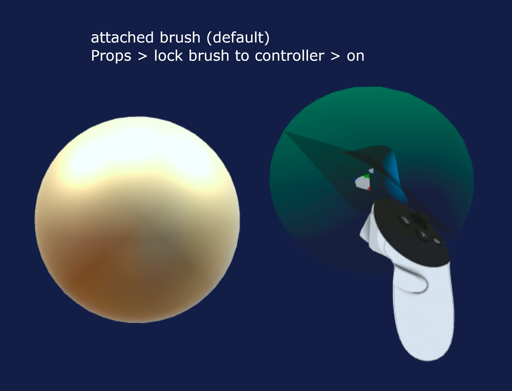
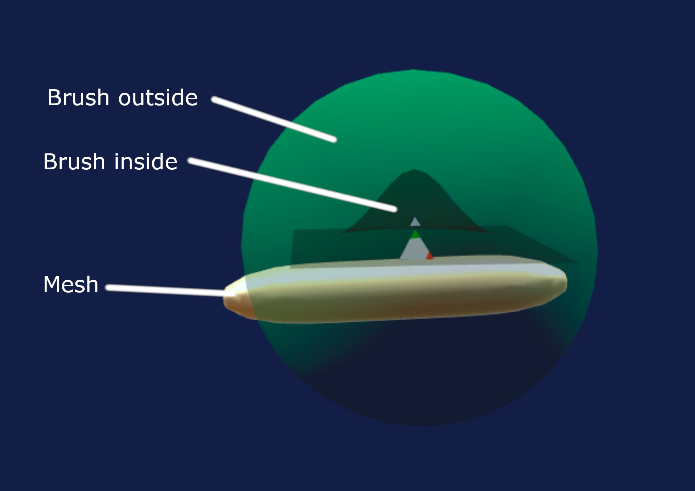

# The brush

The brush is made up of two bubbles, a green one on the outside and a blue one on the inside.

The green bubble is where the dynamic topology will be applied, everything that happens inside the green will have the right level of detail for your shape. You can set the level of detail (LOD) in the Props (Properties) tab.

The blue bubbe is a visualization of the shape the brush will make, for some more abstract brushes like smooth it's just a sphere showing the area of effect.

To stay focused on sculpting, the brush fades a fair amount when it is touching the sculpture, if you need to see it, move it outside of the sculpture and you can observe its shape and size.

## Lock brush to controller aka Attach / Detach
{.imgrow}
{.imgrow}

There are two ways to manipulate the brush, attached to controller or detached.

The setting is Props > lock brush to controller

The default (at first app startup) is for the brush to be attached to your right controller. This mode is ok for starters. You can press the left index trigger to invert the direction of the brush.

The other option is detached mode. In detached mode, the brush floats in midair and you can move it by holding the right grip (middle finger) and moving your right controller, it's a bit like a drag and drop system. This allows you to keep your brush further away from yourself. It is useful if you are sculpting on a large mesh and want to see it from a far and don't like always having your sculpt right in your face. It is recommended for more advanced users.

If you are left-handed there is a left-handed setting in the Preferences tab that will put the brush on the left controller and the menu on the right side.

## Use surface vertices

{.imgrow}
{.imgrow}

A common issue when sculpting is having control over which vertices receive the brush action. For instance imagine you have a thin tube and a large brush. When you press sculpt, do you prefer for the whole tube to be moved, or do you prefer for only one side of the tube (the surface) to move. This is a very common scenario and there is a setting for that, the Property > "use surface vertices" setting. When it is off, the whole tube will move, basically any vertex inside the green bubble is affected regardless of orientation. When is on, only the vertices on the closest surface are picked, so that only one side of the tube is affected by the brush. This setting is so commonly turned on / off that it is mapped to the left controller top button (button Y).

## Use hand movement

By default the brush picks up on the orientation of your controller and sculpts in that direction, so you basically need to find the right angle before pressing sculpt. There is another mode that is also fun that uses the hand movement, in that mode you press sculpt and move your hand in a certain direction and that direction will become the angle of the brush. It is a fun mode for intuitive sculpting but makes it harder to do precise and detailed work. This setting is under the Property tab "use hand movement" and is specific to each brush. It is on by default for the move brush.

## Other settings

There are some other settings for the brush (like strength and such). See [Brush properties](../brushes/1_properties.md)
