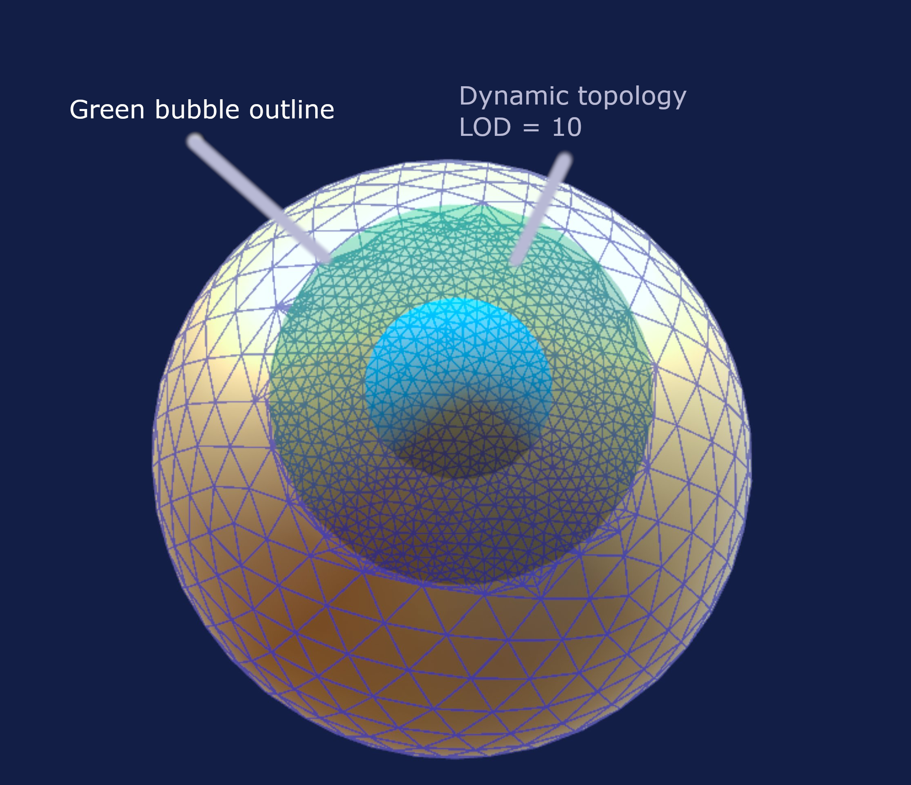
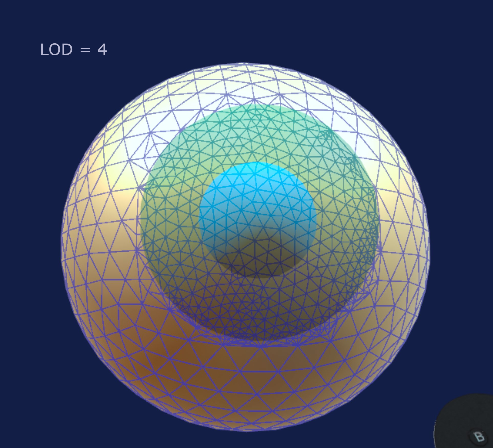
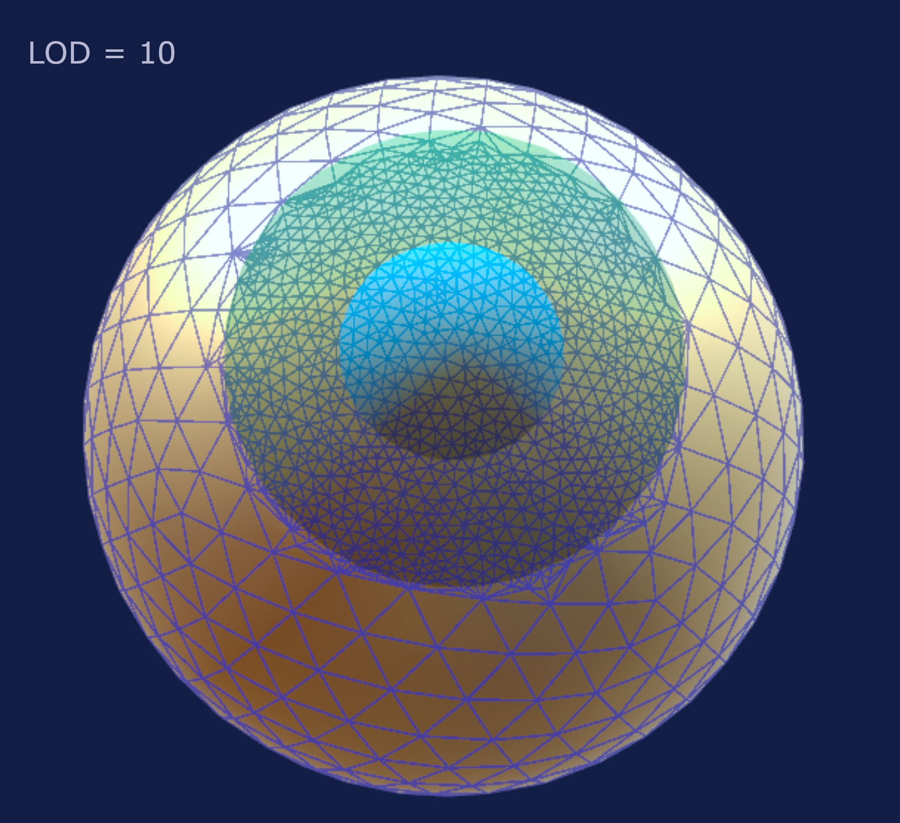

# Dynamic topology

Dynamic topology is a core feature of Chisel. The idea is that you do not need to worry about creating or merging triangles, it will happen automatically

## Green bubble

The topology is applied in the neighborhood of your brush, it happens inside the green bubble. All the triangles inside the green bubble are subdivided or merged to match the LOD (level of detail) that you set in the Props tab.

The blue bubble has no influence over dynamic topology
{.imgrow}

## LOD

Under the Props (Properties) tab there is a setting called LOD. It ranges from 0 to 20. It quantifies how many triangles to create based on the green bubble size. A typical and comfortable range is from 5 to 10. Above 10 is overkill most of the time unless you are doing something that needs sharp details.

The crease brush needs sharp details, so it automatically doubles the LOD when in use.
{.imgrow}
{.imgrow}
## Dynamic topology modes

Under the Props (Properties) tab there is a dropdown menu called dynamice topology. Here you can set the behavior of dynamic topology:

* Brush: this is the default mode, large triangles are subdivided, small triangles are merged.
* Subdivide: in this mode triangles can only be subdivided, not merged. Use this mode if you have a part of your mesh with fine details and you want to apply a large brush, the details will not get lost. It is recommend to switch back to Brush as soon as possible to avoid creating too many triangles.
* Merge: in this mode the triangles can only be merged, never subdivided.
* None: in this mode dynamic topology is deactivated, only the existing vertices can be moved and no new topology is created. You can use this mode with large meshes (>500k) for better performance. For instance on a large mesh, you could enable Brush dynamic topology mode, use the subdivide brush to subdivide the area, then go back to None and move the vertices.

## Shortcut

You can cycle through the dynamic topology modes by holding left index trigger and pressing the Y button on the left controller.
# Notes
## Booleans

The default boolean shapes provided with the app (Cube, Capsule, Sphere etc) do not have a lot of details, it is recommend to use the Smooth or Smooth+ brush on them after a boolean operation with dynamic topology enabled to make a nice transition and fix shading.

## Crease brush

As mentioned before the crease brush doubles the detail for nice sharp features. If the crease brush is not working as intended try to increase LOD to 10 or more.

## Subdivide brush

The subdivide brush applies dynamic topology without moving the vertices. Convenient for adding or removing topology without changing the shape of the mesh.
