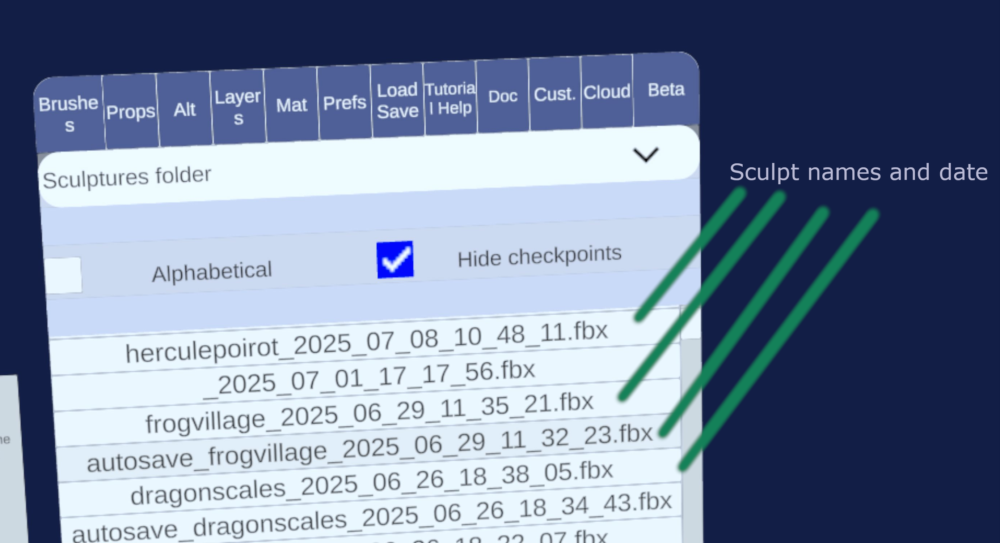
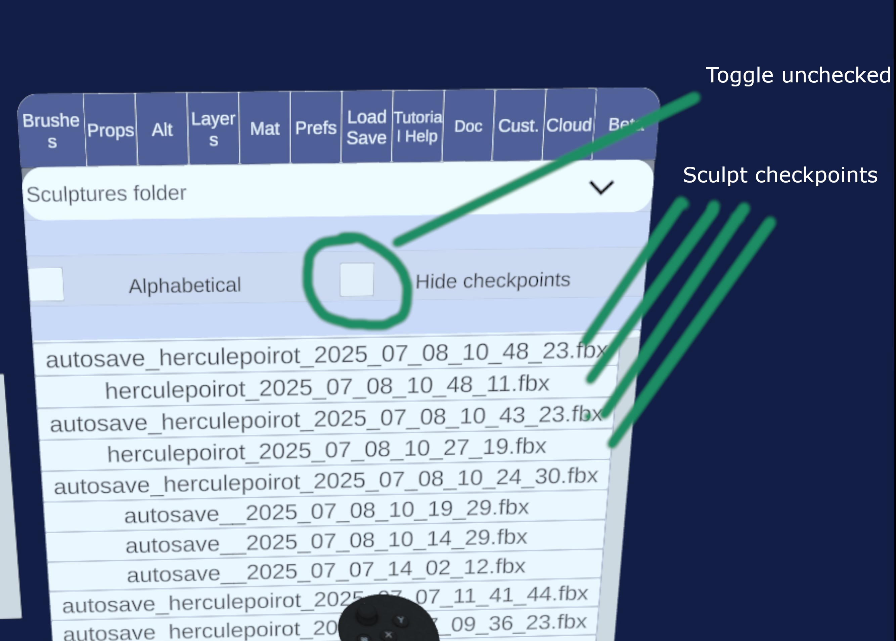
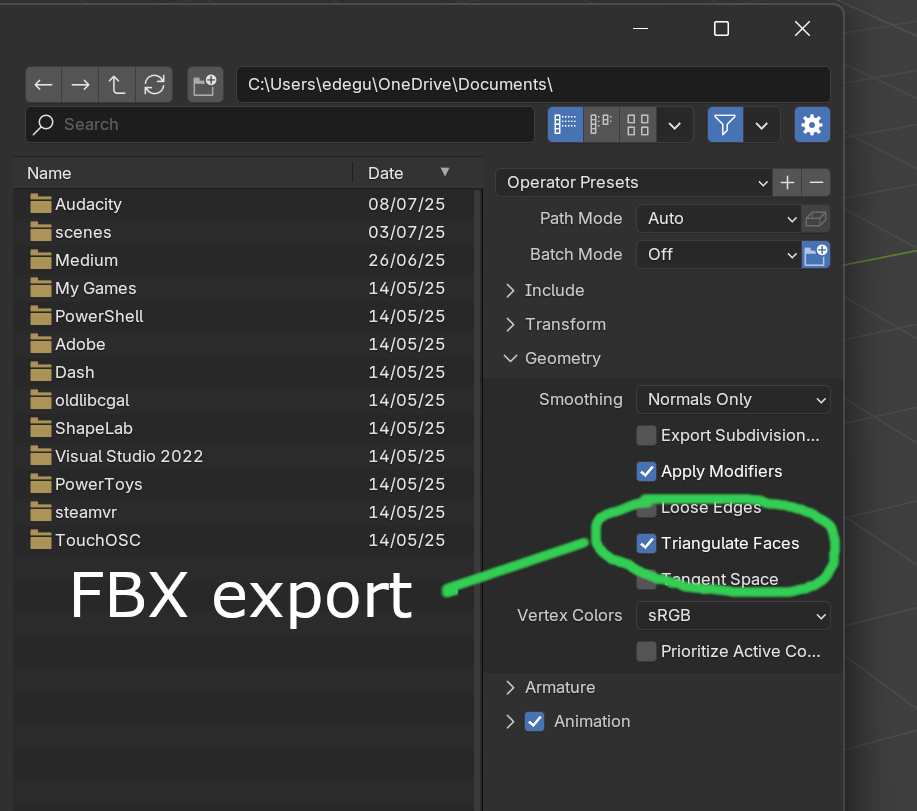

# File management

Chisel is designed with the creative process in mind and tries very hard to let you go back in time.

To serve this goal, every save action (manual or autosave) creates a new file. Quest headsets have tens of gigabyte of storage and most sculpts fit within a few megabytes, so it makes sense to keep copies around.

If you are space constrained, it is possible to delete old save files from within the app (Load / Save > Manage files)

Furthermore, Chisel supports cloud sync for your files with either Dropbox or Google Drive.

## Loading files

Go to the Load Save tab and press Load sculpture. You will see the list of all the sculpts you have saved in the past. By default you will see only the most up to date version. When you click on a file, you will see a preview, click on load to confirm loading the sculpture. Note: for medium to large meshes, the preview is not shown to avoid lag.

Each file automatically has a the date and time indicated as Year_Month_Day_Hour_Minutes_Seconds.
{.imgrow}

### Using an old checkpoint

To see all the versions of the sculpt, uncheck Hide checkpoints, you will see every saved file with the date indicated in the name.
{.imgrow}

### Importing a FBX file from a different app

You can click on the dropdown that says "Sculptures folder" to show other folders on the device, like the Documents or the Download folder. If for instance you downloaded a FBX file from the Quest browser it will be in Download. When prompted allow the permission dialog to access all of external storage (this is required by the operating system). Make sure Hide checkpoints is unchecked, and you can now load external files.

You can import OBJ or FBX.

!!! warning
    Chisel will try to scale the layers so that they fit in your field of view, but sometimes that fails. If the import looks empty see if the layers are loaded in the Layers tab and try to make them bigger or smaller by dragging your controllers while holding both grip buttons.
### Notes on import

Chisel works correctly only on manifold meshes, which means the meshes cannot have holes or missing faces or duplicated vertices. One vertex is used by all touching triangles. After import, Chisel will perform a diagnostic and you will only be able to edit layers that are manifold. Non manifold layers will not be loaded.
### Compatibility with Blender and others

When you export from Blender, export as FBX and make sure you check the "Geometry > Triangulate" toggle. Chisel only works with triangles so Quads and N-Gons are not supported.

{.imgrow}
## Saving files

To save a file you have two options: - Press the X button the left controller, if this is the first time you save it, it will ask for a name. After save each save makes a new checkpoint. If you want to change the name, use the option below. - Go into Load Save tab and press Save sculpture, it will ask you for a name and you can save. This is useful if you want to change the name of the existing file.
### Export

Click on Load Save > Export sculpture, it will save the file in the Documents folder of your Quest. For now you can only export as FBX.

Note: if you import in Blender you will need to adjust the scale, multiplying it by 100 to 200.
## Deleting files - making some space

In the Load Save tab, there is a Manage files button. Press it and from there you will be able to mass delete all checkpoints of a sculpt, or you can uncheck Hide checkpoints and choose which files to delete.

The delete button shows you how many files you are about to delete.

!!! warning
    Be careful, deletion is permanent, unless the file is synced to the cloud.
## Cloud sync

Dropbox and Google Drive are available for syncing your files and keeping backup. To enable them go to the Cloud tab and click on Log into service. You will see some authorization screen. For Google Drive make sure you check all the boxes about sharing data with Chisel. In both cases the sculpts are synced into a folder called Chisel at the root of your cloud storage. The sculpts are made up of a FBX file and a companion .json file, the json file is only useful for Chisel (it keeps tracks of hidden layers, materials and such).

Additionally you can check the auto-sync toggle to sync files in the background, or you can press sync files to sync manually. Only the most recent checkpoint of a sculpt is synced.

You will see a green notification in the sculpt space when all files finish syncing.
